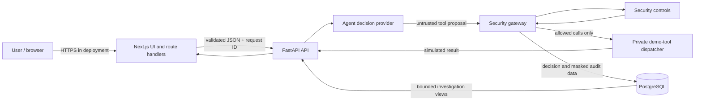

# AgentShield Threat Model

This threat model covers the v1.0.0 MVP: the Next.js dashboard and route
handlers, FastAPI API, deterministic security gateway, demo agent and tools,
and PostgreSQL audit store. It uses STRIDE to identify realistic threats at
the points where data or authority crosses a trust boundary.

## Scope and security objectives

AgentShield must ensure that an AI model cannot directly invoke a protected
tool, every attempted tool call receives a deterministic allow/block decision,
unsafe requests fail closed, and the decision remains traceable without
exposing sensitive values. The four tools are demonstrations only and have no
real email, payment, customer, or network side effects.

Out of scope for the MVP are enterprise identity federation, tenant isolation,
production payment/email integrations, high availability, and protection of a
compromised host or database administrator.

## Architecture and data flow

The security gateway is the only application-facing route to the tool
dispatcher. Model output, user prompts, tool names, arguments, URLs, and
external request IDs are untrusted even when they arrive through an
authenticated upstream system.

## Assets

| Asset | Security need | Why it matters |
| --- | --- | --- |
| Agent and permission identity | Integrity, authenticity | Permissions are meaningless if an attacker can substitute an agent ID. |
| Gateway policy and risk thresholds | Integrity, availability | Changes can turn a blocking control into an allow or deny all valid work. |
| Tool arguments and results | Confidentiality, integrity | They may contain customer data or authorize consequential actions. |
| Audit and security-event records | Integrity, availability, confidentiality | Investigations require complete, untampered evidence with masked secrets. |
| Database credentials and environment configuration | Confidentiality, integrity | Disclosure or tampering can compromise every stored decision. |
| Application and container images | Integrity | Modified code could bypass the gateway or leak data. |
| Service availability | Availability | A gateway outage must not silently produce an authorization bypass. |

## Trust boundaries

1. **Browser to Next.js.** User-controlled input, headers, and query parameters
   enter the application. The browser is not trusted with internal service
   names or database credentials.
2. **Next.js to FastAPI.** The server-side proxy narrows browser access, but all
   forwarded data remains untrusted. Direct development access to FastAPI is
   restricted by its configured CORS allowlist, not treated as authentication.
3. **FastAPI to model provider.** Model output is a proposal, not authority. It
   must match the strict decision schema and can name only registered tools.
4. **Agent service to security gateway.** Trusted request identity is combined
   with untrusted prompts and arguments. The gateway must deny on control
   failure and before dispatch.
5. **Gateway to demo tools.** Crossing this boundary means authorization is
   complete. Only the registry's private dispatcher can execute a tool.
6. **Application to PostgreSQL.** Database writes and investigation reads use a
   service credential. Returned records must be bounded and sensitive arguments
   masked before display.
7. **Host to containers / optional Ollama.** Compose networking and host access
   cross an operational boundary. Ollama is optional and its output receives no
   additional trust.

## STRIDE analysis

| Category | Threat | Affected boundary | Implemented mitigation | Residual risk |
| --- | --- | --- | --- | --- |
| Spoofing | Client supplies another request or agent identity | 1, 2, 4 | Request IDs are format/length validated; the API selects the seeded agent identity; permissions are deny-by-default | MVP has no end-user authentication or cryptographic service identity |
| Spoofing | DNS name resolves to an internal address after URL validation | 5, 7 | Demo URL fetches are fixtures and have no network side effect; literal private, loopback, link-local, reserved, decimal, and localhost destinations are blocked | A future real fetcher needs DNS resolution checks, redirect revalidation, and egress controls |
| Tampering | Model changes the requested tool or arguments | 3, 4 | Strict Pydantic schemas, registered-tool allowlist, argument constraints, permission checks, and policy controls run after the model | Semantic abuse within otherwise valid fields remains possible |
| Tampering | Policy or audit data is modified directly in PostgreSQL | 6 | Application validation, immutable audit entries for policy changes, and migrations constrain normal writes | A database administrator can alter MVP records; append-only/WORM storage is not provided |
| Repudiation | Actor denies making a dangerous request | 1, 2, 6 | Correlated request IDs, tool-call records, security events, timestamps, reason codes, decisions, and durations | There is no authenticated user identity or signed log chain |
| Information disclosure | PII is exfiltrated through email arguments | 3, 4, 5 | Sensitive-data and external-destination checks block the demonstrated exfiltration pattern; UI masks sensitive argument keys | Pattern matching can miss novel encodings or context-dependent sensitive data |
| Information disclosure | Secrets appear in logs or investigation APIs | 2, 6 | Structured logging avoids raw prompts/results; investigation serializers mask known sensitive keys; bounded list APIs | Free-form values can contain secrets that keyword masking does not recognize |
| Denial of service | Huge prompts, arguments, or unbounded queries consume resources | 1, 2, 4, 6 | Pydantic length/range limits, bounded pagination, request timeouts, health checks, and per-agent rate limits | No distributed rate limiter, global quota, or edge request-size limit in the MVP |
| Denial of service | A security control or database becomes unavailable | 4, 6 | Controls fail closed; readiness reports database failure; Compose health checks gate startup | Fail-closed behavior preserves safety but can deny all useful work |
| Elevation of privilege | Agent invokes an unauthorized or unknown tool | 3, 4, 5 | Registry allowlist, deny-by-default stored permissions, active-agent/tool checks, and private dispatch | Compromised application code or host can bypass in-process controls |
| Elevation of privilege | Prompt injection persuades the model to bypass policy | 3, 4 | Prompt-injection signals are normalized and scored; deterministic controls execute outside the model | Heuristic detection is incomplete; authorization controls remain the primary boundary |
| Elevation of privilege | SSRF reaches metadata or local services | 4, 5, 7 | URL schema validation and network-destination policy block unsafe literal targets; demo fetcher is side-effect free | Alternate encodings and DNS rebinding require additional defenses before real networking |

## Mitigation strategy

- Keep policy enforcement outside the model and require every tool path to enter
  through `ToolGateway`.
- Deny unknown tools, missing permissions, invalid arguments, unsafe
  destinations, rate-limit excesses, detected exfiltration, and control errors.
- Treat controls as independent signals, combine them into a deterministic
  score, and retain stable reason codes for audit and testing.
- Validate at API and tool-schema boundaries; normalize Unicode before textual
  security matching.
- Correlate tool calls and security events using bounded request IDs, mask known
  sensitive arguments, and avoid logging raw untrusted content.
- Keep browser-to-backend traffic behind same-origin Next.js routes, use
  explicit CORS origins for direct development access, and keep internal URLs
  server-only.
- Run containers as unprivileged users, gate service startup on health checks,
  pin dependency manifests, and scan source, secrets, dependencies, and images
  in CI.

## Residual risks and release constraints

The MVP's prompt and PII detectors are explainable heuristics, not complete
solutions. They can produce false positives and false negatives, especially
with obfuscation, multiple languages, encoded content, or domain-specific data.
The in-memory rate limiter does not coordinate across processes and resets on
restart. Investigation records are not cryptographically tamper-evident. There
is no user authentication, tenant model, fine-grained administrative role, or
production secrets manager. The demo tools must remain simulated until real
connectors add outbound network controls, destination resolution and redirect
validation, idempotency, stronger identity, and human approval for high-impact
actions.

## Review triggers

Review this model before adding a real external tool, authentication, a new
deployment environment, multi-tenancy, a model/provider that receives sensitive
data, or any change that allows actual outbound network, email, or payment side
effects. Also review after a security incident or a material control bypass.
